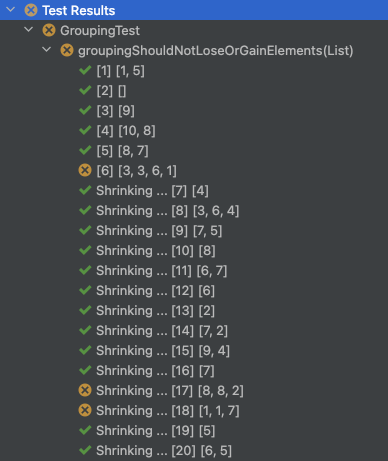
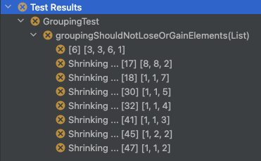
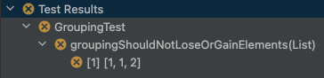

# Americium - **_Property based testing for Java and Scala! Automatic test case shrinkage! Bring your own test style._**

[](https://index.scala-lang.org/sageserpent-open/americium/americium)

[](https://scala-steward.org)

**Requires JRE 17 LTS or later since release 1.19.6.**

Take the tour: [Americium Site](https://sageserpent-open.github.io/americium).

## Example

Some code we're not sure about...

```java
public class PoorQualityGrouping {
  // Where has this implementation gone wrong? Surely we've thought of
  // everything?
  public static <Element> List<List<Element>> groupsOfAdjacentDuplicates(
          List<Element> elements) {
    final Iterator<Element> iterator = elements.iterator();

    final List<List<Element>> result = new LinkedList<>();

    final LinkedList<Element> chunk = new LinkedList<>();

    while (iterator.hasNext()) {
      final Element element = iterator.next();

      // Got to clear the chunk when the element changes...
      if (!chunk.isEmpty() && chunk.get(0) != element) {
        // Got to add the chunk to the result before it gets cleared
        // - and watch out for empty chunks...
        if (!chunk.isEmpty()) result.add(chunk);
        chunk.clear();
      }

      // Always add the latest element to the chunk...
      chunk.add(element);
    }

    // Don't forget to add the last chunk to the result - as long as it's
    // not empty...
    if (!chunk.isEmpty()) result.add(chunk);

    return result;
  }
}
```

Let's test it - we'll use the integration with JUnit5 here...

```java
class GroupingTest {
  private static final TrialsScaffolding.SupplyToSyntax<ImmutableList<Integer>>
          testConfiguration = Trials
          .api()
          .integers(1, 10)
          .immutableLists()
          .withLimit(15);

  @ConfiguredTrialsTest("testConfiguration")
  void groupingShouldNotLoseOrGainElements(List<Integer> integerList) {
    final List<List<Integer>> groups =
            PoorQualityGrouping.groupsOfAdjacentDuplicates(integerList);

    final int size =
            groups.stream().map(List::size).reduce(Integer::sum).orElse(0);

    assertThat(size, equalTo(integerList.size()));
  }
}
```

What happens?

- Americium runs the same test repeatedly against different test case inputs, and finds a failing test case. Oh dear...



- The first failing test case leads to an automatic shrinkage process that yields a maximally shrunk test case. See how
  the failing test case's values lie between 1 and 10, just as specified in the test. Shrinking respects the constraints
  we configured into our test data...



- Americium also tells us what the maximally shrunk test case was and how to reproduce it immediately when we re-run the
  test...

```
Case:
[1, 1, 2]
Reproduce via Java property:
trials.recipeHash=3b2a3709bf92b8551b2e9ae0b8b6d526
Reproduce via Java property:
trials.recipe="[{\"ChoiceOf\":{\"index\":1}},{\"FactoryInputOf\":{\"input\":2}},{\"ChoiceOf\":{\"index\":1}},{\"FactoryInputOf\":{\"input\":1}},{\"ChoiceOf\":{\"index\":1}},{\"FactoryInputOf\":{\"input\":1}},{\"ChoiceOf\":{\"index\":0}}]"
```



Now go and fix it! (_HINT:_ `final LinkedList<Element> chunk = new LinkedList<>();` Why final? What was the intent? Do
the Java collections work that way? Maybe the test expectations should have been more stringent?)

## Goals

- Agnostic - as long as your test takes a test case, throws an exception when it fails and completes normally otherwise,
  it can be used with Americium.
- Lightweight - there is no provided assertion language or property DSL; Americium is about building test cases,
  supplying them to a test and shrinking down failing test cases. Your tests, your style of writing them.
- Suitable for Java and Scala - there are two APIs, each optimised for the choice of language.
- Shrinkage is automatic and respects test case invariants. You don't write shrinkage code and your shrunk test cases
  conform to how you want them built.

## You said something about a tour?

I certainly did; get your ticket here: [Americium Site](https://sageserpent-open.github.io/americium).

If you'd prefer me to get my slide projector out and watch the holiday snaps from yesteryear: [Americium Wiki](https://github.com/sageserpent-open/americium/wiki).


